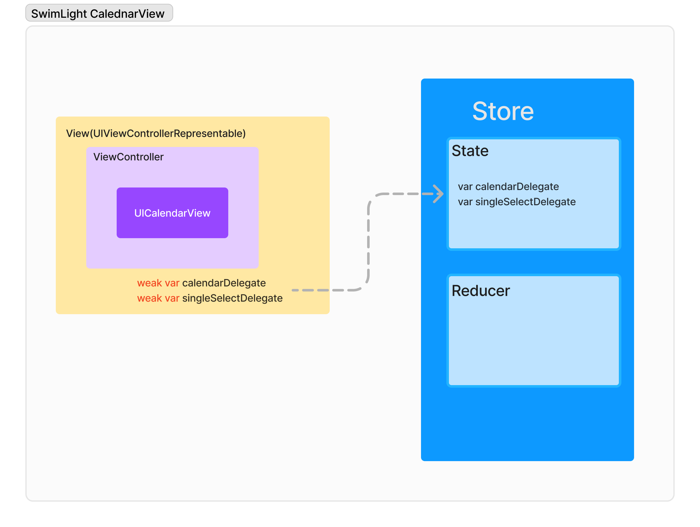
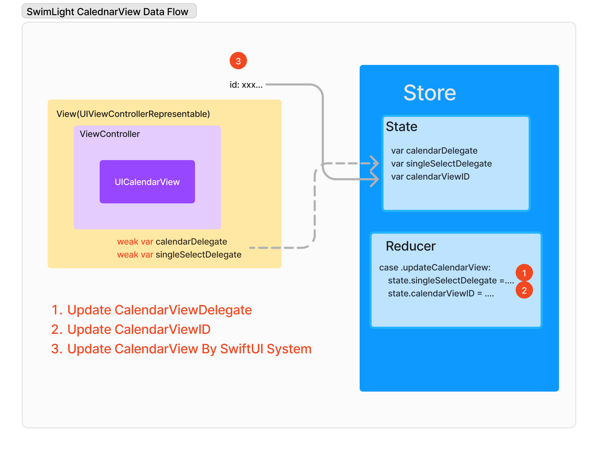
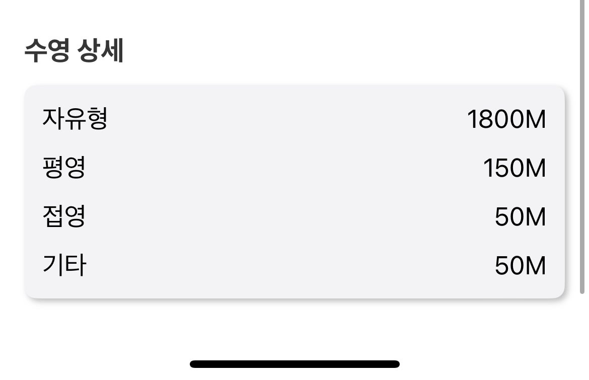
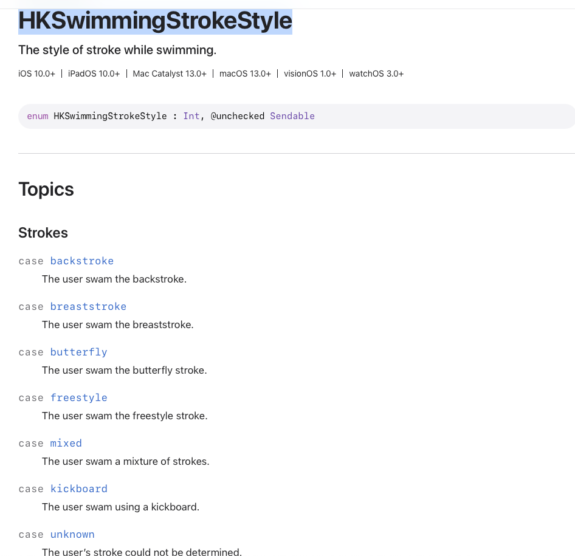

# Swimlight
Swimlight는 수영 애호가들을 위한 혁신적인 iOS 애플리케이션입니다. HealthKit의 수영 관련 데이터를 광범위하게 활용하여 사용자에게 포괄적인 수영 경험과 상세한 분석을 제공합니다. (2024.09.16 ~ 18, 30)

<br/><br/>

# 주요 기능 🏊🏊‍♀️🏊‍♂️ 
## 1. 종합적인 수영 데이터 분석
   - SLHealthKitManager를 통한 HealthKit 데이터의 심층적 활용
   - 수영 세션, 거리, 칼로리 소모량, 심박수 등 다양한 수영 관련 데이터 추적 및 분석

## 2. 상세한 수영 성과 모니터링
   - 일별, 월별 수영 성과 추적
   - 평균 페이스, 거리, 칼로리 소모량, 운동 시간 등의 지표 제공

## 3. 심박수 분석

  - 수영 중 심박수 데이터 수집 및 분석
  - 심박수 구간별 운동 시간 계산
  - 상세한 심박수 차트 제공


## 4. 수영 스타일 분석

- 다양한 수영 스타일(자유형, 배영, 평영, 접영 등)별 거리 측정

<br/><br/>

# 기술 스택

- Swift
- SwiftUI
- HealthKit
- Combine
- Tuist
- TheComposableArchitecture

<br/><br/>

# 🔥 트러블 슈팅 + 기술적 도전

## UIView + SwiftUI(UIViewControllerRepresentable 100퍼센트 활용하기)

SwiftUI와 UIKit의 생명주기를 Sync 하여, UIKit Comoponent를 100퍼센트 활용하였습니다. 
UICalendarView를 UICalendarViewController로 만들고, 이를 SwiftUIView로 만들었습니다.
그리고 UICalendarView의 업데이트 주기를 SwiftUI 뷰 업데이트 주기에 맞췄습니다.





<br/><br/>

## Stroke Meta Data 가져오기

Stroke종류(자유형, 평형, 배영, 접영, 킥판, 기타) Meta Data에 관한 항목이 에플 문서에 자세하게 써있지 않아서 다양한 HealthKit쿼리를 날려보면서 찾았습니다. 
또한 MetaData를 찾고 나서도 스트로크에 관한 정보들을 통해 다시 HealthKit에 질의하는 과정들이 있었습니다.
참고할 자료들이 없어서 코드를 작성하는데 오래 걸렸습니다. 

### 완성 화면



### Apple HKSwimmingStrokeStyle



### Code

```swift
 /// Retrieves the distance swam for each stroke style on a specific date.
  /// - Parameter date: The date to retrieve stroke style distances for.
  /// - Returns: A dictionary mapping `SLStrokeStyle` to distance in meters.
  /// - Throws: An error if the retrieval or processing fails.
  var getStrokeStyleDistance: (_ date: Date) async throws -> [SLStrokeStyle: Int]
  private static func _getStrokeStyleDistance(_ targetDate: Date) async throws -> [SLStrokeStyle: Int] {
    // Closure to get distance for a specific time range
    let getDistanceClosure: (_ startDate: Date, _ endDate: Date) async throws -> Int? = { startDate, endDate in
      let datePredicate = HKQuery.predicateForSamples(withStart: startDate, end: endDate)
      let swimWorkoutPredicate = NSCompoundPredicate(andPredicateWithSubpredicates: [
        datePredicate,
      ])
      let distances = try await withCheckedThrowingContinuation { (continuation: CheckedContinuation<[HKSample], Error>) in
        store.execute(
          HKSampleQuery(
            sampleType: HKQuantityType(.distanceSwimming),
            predicate: swimWorkoutPredicate,
            limit: HKObjectQueryNoLimit,
            sortDescriptors: [.init(keyPath: \HKSample.startDate, ascending: false)],
            resultsHandler: { _, samples, error in
              if let hasError = error {
                continuation.resume(throwing: hasError)
                return
              }
              guard let samples else {
                continuation.resume(throwing: NSError())
                return
              }
              continuation.resume(returning: samples)
            }
          )
        )
      }
      guard let distance = distances.first as? HKQuantitySample else {
        return nil
      }
      let targetDistance = Int(distance.quantity.doubleValue(for: .meter()))
      return targetDistance
    }

    // Get swim stroke style samples
    let (startDate, endDate) = startAndEndOfDay(for: targetDate)
    let datePredicate = HKQuery.predicateForSamples(withStart: startDate, end: endDate)
    let swimWorkoutPredicate = NSCompoundPredicate(andPredicateWithSubpredicates: [
      datePredicate,
    ])
    let workoutSamples = try await withCheckedThrowingContinuation { (continuation: CheckedContinuation<[HKSample], Error>) in
      store.execute(
        HKSampleQuery(
          sampleType: HKQuantityType(.swimmingStrokeCount),
          predicate: swimWorkoutPredicate,
          limit: HKObjectQueryNoLimit,
          sortDescriptors: [.init(keyPath: \HKSample.startDate, ascending: false)],
          resultsHandler: { _, samples, error in
            if let hasError = error {
              continuation.resume(throwing: hasError)
              return
            }
            guard let samples else {
              continuation.resume(throwing: NSError())
              return
            }
            continuation.resume(returning: samples)
          }
        )
      )
    }

    // Calculate distance for each stroke style
    var distanceByStrokeStyle: [SLStrokeStyle: Int] = [:]
    await workoutSamples.asyncForEach { sample in
      if let strokeStyleInt = sample.metadata?["HKSwimmingStrokeStyle"] as? Int,
         let strokeStyle = SLStrokeStyle(rawValue: strokeStyleInt),
         let targetDistance = try? await getDistanceClosure(sample.startDate, sample.endDate) {
        distanceByStrokeStyle[strokeStyle, default: 0] += targetDistance
      }
    }
    return distanceByStrokeStyle
  }


```
<br/><br/>


## HeartRate관련 로직

애플 헬스킷에서는 심박수 존에 관한 정보들을 제공하지 않습니다. 그래서 사용자에게 심박수 존을 보여주기 위해서 직접 심박수 Zone에 관한 로직을 생성했습니다. 

### 작동 화면


### Code
```swift
// Calculates the time spent in different heart rate zones during swimming workouts on a specific date.
  /// - Parameter date: The date to calculate heart rate zones for.
  /// - Returns: A dictionary mapping `HeartRateZone` to time spent in that zone (in seconds).
  /// - Throws: An error if the calculation fails.
  var calculateTimeInHeartRateZones: (_ date: Date) async throws -> [HeartRateZone: TimeInterval]
  private static func _calculateTimeInHeartRateZones(targetDate: Date) async throws -> [HeartRateZone: TimeInterval] {
    let heartRateSamples = try await getTargetDateSwimmingHeartRateSamples(targetDate).flatMap { $0 }

    let zoneManager = HeartRateZoneManager(maximumHeartRate: 190)
    var res: [HeartRateZone: Double] = [:]

    var prevDate: Date?
    heartRateSamples.forEach { sample in
      let heartRateUnit = HKUnit.count().unitDivided(by: HKUnit.minute())
      let heartRate = Int(sample.quantity.doubleValue(for: heartRateUnit))
      guard let heartRateZone = zoneManager.getHeartRateZone(for: heartRate) else {
        return
      }
      // Handle case when there's no previous data
      guard let targetPrevDate = prevDate else {
        prevDate = sample.startDate
        return
      }

      let interval = sample.startDate.timeIntervalSince(targetPrevDate)
      // Skip if interval is too long or negative
      if interval / 60 > 5 || interval < 0 {
        prevDate = nil
        return
      }
      res[heartRateZone, default: 0] += interval
      prevDate = sample.endDate
    }
    return res
  }
```

더 많은 코드를 헬스킷 코드를 보고 싶다면 `SLHealthKitManager`객체를 참고해주세요! 
